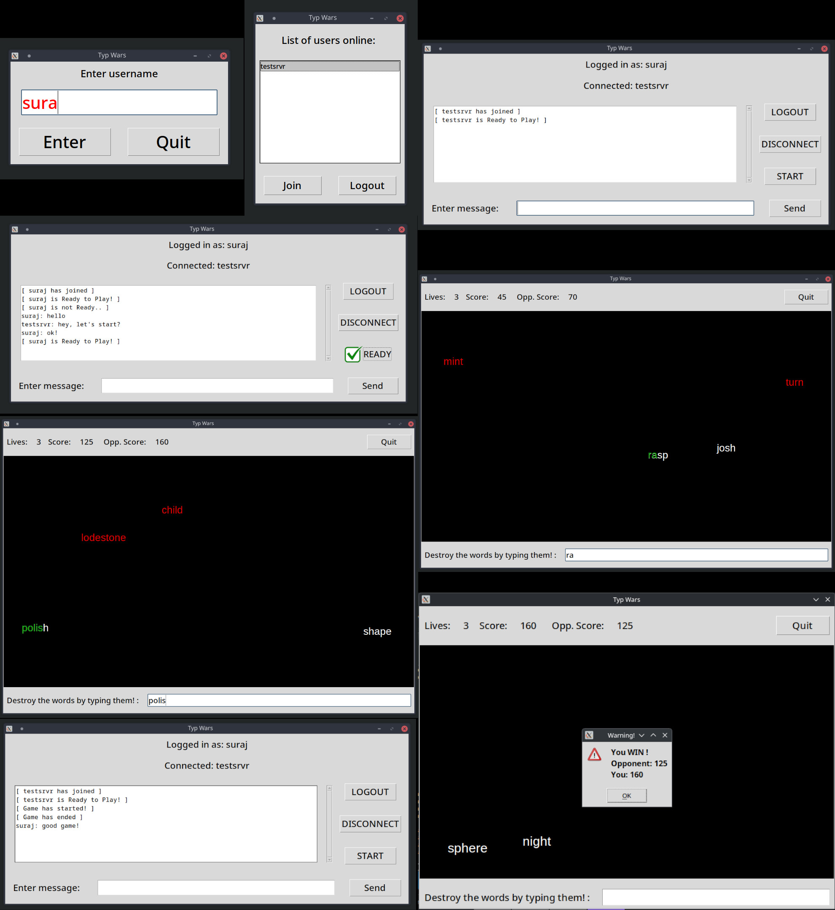

# **Typ-Wars**
## A simple SP and LAN MP typing game

### How to play
Type the words on spawning on screen to destroy them before they reach the bottom of the screen.  
Created using tkinter GUI library.  
In multiplayer mode you can also type dictionary words to send them to your opponent.  
If you partially typed a word, the correctly typed part will be highlighted in green.
### Lives
You have 3 lives, you lose a life if a word reaches the bottom of the screen.
### Scoring
Score system which increases difficulty with your score.
### Difficulty
Difficulty comes from faster falling speed, longer words and more words on screen at the same time.  
There are 6 difficulty levels.
### Multiplayer
LAN P2P multiplayer feature with peer discovery done via local multicast.  
TCP/UDP listener socket functions and game handling functions are threaded for parallel processing.  
Lobby chat available before starting multiplayer game.  
Ready system for client to let the server know that they are ready to start the game.  
P2P network communication through sockets and listener threads.  
Multiplayer has word spawner with reduced frequency.  
Players mostly try to send each other words to compete.  
Words sent by your opponent player will be highlighted as red.
> [!NOTE]
> Sending a word to your opponent will give you double the score.

> [!WARNING]
> If you send a word which is already on your opponent's screen, you will help them out! (10x score)
### Latest Patch (1.0.0) notes
- Created music and sound (using Beepbox)
- Added sound for typing correct and wrong words
- Added gameplay music
